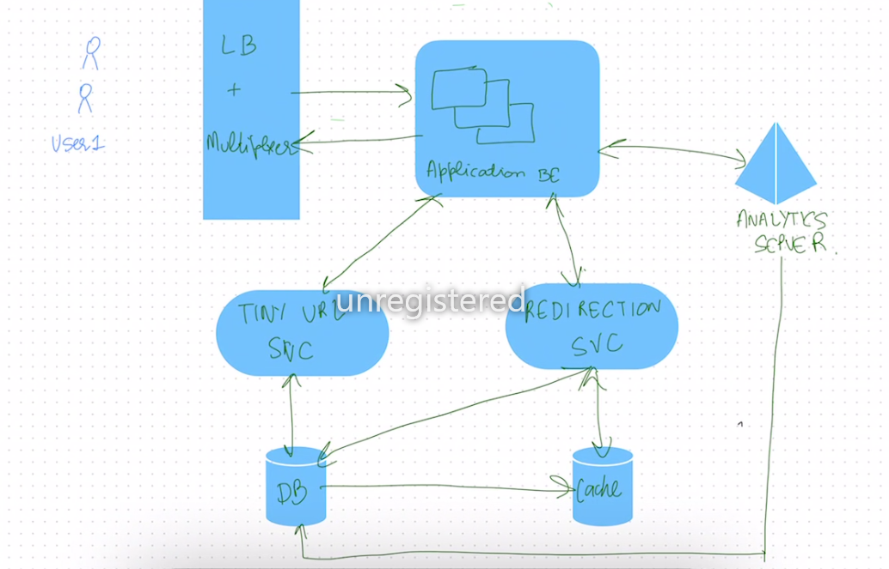

Tiny URL

## Requirements

### Functional Requirements
what does the user wanna do

1. generate a short unique url for the given url
2. redirect anyone who clicks the link to the shortened url to the original site
3. link expiration
4. [optional] allow users to customize the URL
5. [optional] analytics on the shortened URL

### Non-Functional Requirements
what does the system wants to do

1. high availablity
2. low latency
3. scalibility
4. durability
5. security to phishing

### Capacity Estimation
basic estimations based on the given traffic

#### Assumption
1. Daily requests -> 1 million / day
2. Read / Write -> 100:1
3. Peak Traffic -> 10x
4. original Url Length -> max of 100 characters

#### Calculation

1. Write / day = 10^6/24*60*60 = 12 requests/sec
2. at peak = 120 requests/sec

1. Read/ day = 120 requests/sec
2. at peak = 1200 requests/sec

##### Unique urls estimations

8 characters long, every character can have 52 (lower case and upper case) + 9(digits)
61^8 ~ 2*10^14

enough to hold all the rights

##### Storage

short url = 8 characters
original url = 100 characters
creation time = 8 bytes
expiration time = 8 bytes
click count = 4 bytes

total bytes = 128 bytes

total writes = 10^6 * 365 * 127 =46355 *10^6 bytes= 46 * 10^9 bytes ~ 50 GB for a year

## Core Entities
terms central to the system

tiny url service -> CRUD
tiny url generation -> hasshing mechanism
anaylitics service
cache for hot retrievs

## API Design

POST /tinyurl/create
{
    originalUrl
    customUrl
    customExpirationTime
    user_id /// can be added to the storage estimation as well, wont impact much tho
}

GET /tinyurl/

get the information from the cache or the database and redirect the GET to the original URL

## High Level Design

## Deep Dives

1. How to generate the tinyUrl

the best to generate the tinyUrl is the hash function to generate the 128 bits of the hash.
using the first 6 bytes -> base62 encode gives he final form

how to handle the hash collisions across the system
altho hash collisions are rare it can still happen, we let the user handle this scenario, in which it tests the url redirection
before sending the not the tinyruls, if yes. we can rehash the it with adding a timestamp of creation, we store that info while sending the post message

