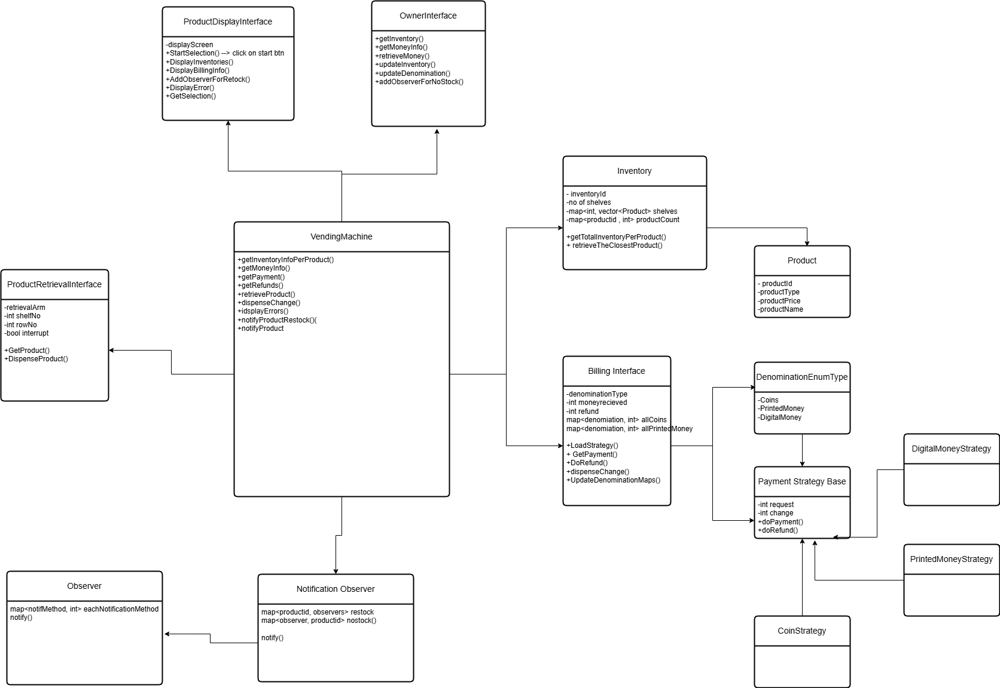

Vending Machine

# Requirements
The vending machine should support multiple products with different prices and quantities.
The machine should accept coins and notes of different denominations.
The machine should dispense the selected product and return change if necessary.
The machine should keep track of the available products and their quantities.
The machine should handle multiple transactions concurrently and ensure data consistency.
The machine should provide an interface for restocking products and collecting money.
The machine should handle exceptional scenarios, such as insufficient funds or out-of-stock products.

# Entities

1. Product
3. Inventory 
4. Display Interface -> interacts with the inventory and the billing operations
5. Product Retrieval Interface -> takes command from the orchestrator, after it verifies every operation / payment to inventory
6. Owner Interface -> Lets you update the Inventory, and the Billing Currencies (maybe owner wants to take the notes and add more coins for change)
7. Billing -> accept coins, notes, (or even digital means), also stores the existing currencies in the system ( to check if we can return appropriate change)
8. Central Vending Orchestrator -> interacts with every part Billing ,DisplayInterface , Inventory, ProductRetrieval Arm
9. Observer or notifier to the Owners email / phone. Could be restocking notification to a customer if he is interested

To handle the concurrent change lock guard ,
mutex holds the inventory + billing to dispense the change until the final retrieval arm success 
then releases the lock on the inventory as well the Billing ( lets say the final retrieval fails, you dont want to give the change away sooner, if it fails you should return the original amount)

Also we have an interrupt for the productRetrievalArm, so we can cancel the operation in case the customer decicdes to cancel after everything.
Or there is a techinical issue.

## Image

